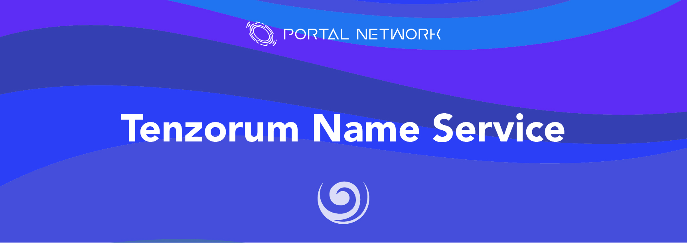

> 📖🔍 Documents of the Tenzorum Name Service.

## 💡 Introduce Tenzorum
Tenzorum is the portal to use the web of the future in your devices, today. It allows you to get the full benefits of decentralization without compromising on user-experience or security.

## 📝 Description

TNS is the Tenzorum Name Service, a distributed, open, and extensible naming system based on the Tenzorum.

## 📚 Documents

#### Table of Contents
-  [Introduction](./docs/INTRODUCTION.md)

## 📣 Contributing
See [CONTRIBUTING.md](./CONTRIBUTING.md) for how to help out.

## 🗒 Licence
See [LICENSE](./LICENSE) for details.
